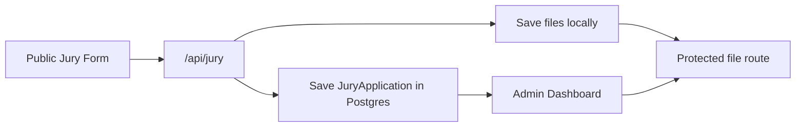
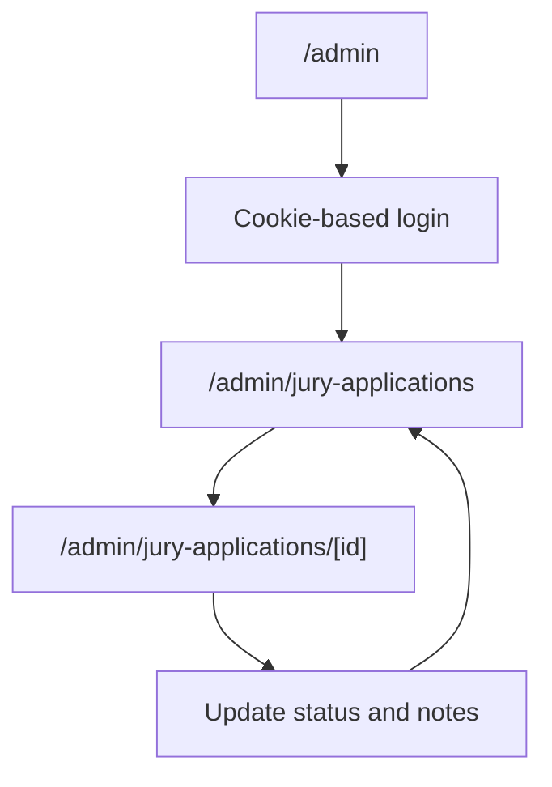

# IBPA Beauty Championship

A Next.js 16 application for the IBPA Beauty Championship website. The project combines a public-facing marketing site, a jury application workflow, database-backed APIs, and an internal admin review dashboard.   

## Overview

| Area | Purpose |
| --- | --- |
| Public pages | Present the championship, categories, grand prix rules, and jury information |
| Jury application | Accept jury applications with uploaded files and store them locally + in Postgres |
| Admin review | Let internal reviewers inspect applications, open files, and update status |
| Prisma layer | Manage categories, awards, participant applications, jury applications, and payments |

## Stack

- Next.js 16 App Router   
- React 19
- TypeScript
- Tailwind CSS 4
- Prisma 7 with PostgreSQL
- Stripe dependency installed for future payment work  

## Main Flows 





## Project Structure

```text
app/
  admin/                        Admin login and jury review dashboard
  api/                          Route handlers for categories, jury, applications, files
  apply/jury/                   Public jury application page
  jury/                         Public jury information page
components/
  admin/                        Admin UI pieces
  home/                         Homepage sections
  jury/                         Jury landing and application UI
  layout/                       Shared header/footer
data/
  home.ts                       Homepage copy and category data
  uploads/jury/                 Local file storage for jury uploads
lib/
  admin-auth.ts                 Cookie-based admin auth helpers
  prisma.ts                     Shared Prisma client
prisma/
  schema.prisma                 Database schema
  migrations/                   SQL migrations
  seed.ts                       Seed data for categories and awards
```

## Routes

### Public pages

| Route | Purpose |
| --- | --- |
| `/` | Homepage |
| `/jury` | Public jury information page |
| `/apply/jury` | Public jury application form |
| `/categories` | Categories page |
| `/grand-prix` | Grand Prix page |
| `/admin` | Internal admin login page |

### API routes

| Route | Method | Purpose |
| --- | --- | --- |
| `/api/jury` | `POST` | Validate and store jury applications |
| `/api/applications` | `GET`, `POST` | Participant application test API |
| `/api/categories` | `GET` | Return all categories |
| `/api/categories/[id]/awards` | `GET` | Return awards for one category |
| `/api/admin/jury-files/[fileId]` | `GET` | Securely stream a stored jury file for admins |

## Database Model

### Existing production-ish models

- `Category`
- `Award`
- `Application`
- `ApplicationAnswer`
- `ApplicationFile`
- `Payment`
- `JuryApplication`
- `JuryApplicationFile`

### Jury-specific data

`JuryApplication` stores the reviewable application record:

- applicant identity and contact info
- professional background
- expertise areas
- bio, disclosure, motivation
- review status
- admin notes and review timestamp

`JuryApplicationFile` stores metadata for saved uploads:

- profile photo
- certifications
- local `storageKey` path

## Jury Upload Storage

Jury uploads are currently stored on the local filesystem:

```text
data/uploads/jury/<application-id>/
```

The actual uploaded file is written to disk, and the database stores:

- original file name
- mime type
- file size
- `storageKey`

This keeps the first version simple, but it is meant as a local-storage phase, not a long-term production upload strategy.

## Admin Authentication

The admin area currently uses a lightweight cookie-based flow in [lib/admin-auth.ts](./lib/admin-auth.ts).

Current behavior:

- login happens on the server
- a signed-in admin gets an `httpOnly` cookie
- admin pages call `requireAdmin()`
- protected files are only returned if that cookie is present

Important:

- the admin password is currently hardcoded for internal/demo use
- this should be moved to environment variables before production use

## Local Setup

### 1. Install dependencies

```bash
npm install
```

### 2. Configure environment variables

Create a local `.env` file with at least:

```env
DATABASE_URL="postgresql://..."
```

### 3. Generate Prisma client

```bash
npx prisma generate
```

### 4. Run migrations

```bash
npx prisma migrate deploy
```

For local development, `npx prisma migrate dev` is also reasonable if you are iterating on schema changes.

### 5. Seed starter category data

```bash
npx tsx prisma/seed.ts
```

### 6. Start the app

```bash
npm run dev
```

## Useful Commands

| Command | Purpose |
| --- | --- |
| `npm run dev` | Start local dev server |
| `npm run build` | Production build |
| `npm run start` | Start production server |
| `npm run lint` | Run ESLint |
| `npx prisma generate` | Regenerate Prisma client |
| `npx prisma migrate deploy` | Apply migrations |
| `npx tsx prisma/seed.ts` | Seed categories and awards |
| `npm run test:application-submission` | Submit a local smoke-test application to `TEST_APP_URL` or `http://localhost:3000` |

## Production Environment

Set these in Vercel/Render before deploying production. Do not paste secrets into logs or commits.

```env
DATABASE_URL="postgresql://..."
BLOB_READ_WRITE_TOKEN="..."
STRIPE_SECRET_KEY="sk_live_... or sk_test_..."
STRIPE_WEBHOOK_SECRET="whsec_..."
RESEND_API_KEY="re_..."
APP_URL="https://your-production-domain.com"
EMAIL_NO_REPLY="forum-no-reply@ibpassociations.org"
EMAIL_PAYMENTS="forum-payments@ibpassociations.org"
EMAIL_APPLICATIONS="forum-applications@ibpassociations.org"
EMAIL_SUPPORT="forum-support@ibpassociations.org"
EMAIL_TEST="dev@ibpassociations.org"
EMAIL_REDIRECT_ALL_TO_TEST=false
```

Aliases supported by the app:

```text
APP_URL, FRONTEND_URL, or NEXT_PUBLIC_APP_URL
EMAIL_NO_REPLY, NO_REPLY_EMAIL, or EMAIL_FROM
EMAIL_PAYMENTS or PAYMENT_EMAIL
EMAIL_APPLICATIONS or APPLICATIONS_EMAIL
EMAIL_SUPPORT or SUPPORT_EMAIL
```

For local Stripe webhook testing, run the app and then:

```bash
stripe listen --forward-to localhost:3000/api/stripe/webhook
```

Copy the displayed `whsec_...` value into `STRIPE_WEBHOOK_SECRET` for the local shell or `.env.local`, then trigger a Checkout payment or use:

```bash
stripe trigger checkout.session.completed
```

Stripe key mode matters: if production uses a test `STRIPE_SECRET_KEY`, the production
`STRIPE_WEBHOOK_SECRET` must come from a test-mode webhook endpoint or Stripe CLI session.
If production uses a live key, use the live-mode webhook secret.

## Current Status

### Implemented

- Public homepage and marketing sections
- Public jury information page
- Jury application form
- Local file saving for jury uploads
- Postgres persistence for jury applications
- Admin login
- Admin application list
- Admin application detail/review page
- Protected file viewing for admins

### Still rough / placeholder

- `/apply` is still a test page for the participant application API
- `/api/payments` is not implemented yet
- some nav/footer links still point to `#`
- site metadata/title is still default and should be branded
- admin auth is intentionally simple for now

## Notes For Future Improvements

- Move admin credentials to `.env`
- Replace local uploads with cloud storage
- Finish participant application UI
- Implement real payment flow
- Replace placeholder links in header/footer
- Add search/filtering to the admin list
- Add audit history or reviewer identity for admin actions

## Development Reminder

This project uses a newer Next.js version with breaking changes compared with older examples. When adding framework-level features, check the local docs inside:

```text
node_modules/next/dist/docs/
```
