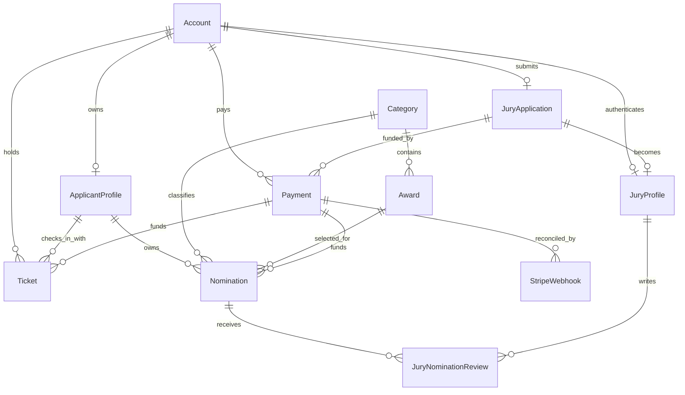

# Forum database refactor

## Outcome

The application now uses the isolated PostgreSQL schema `forum_next`. It contains exactly the 13 requested business tables and no supporting join tables:

`Account`, `ApplicantProfile`, `JuryApplication`, `JuryProfile`, `JuryNominationReview`, `Nomination`, `Award`, `Category`, `Ticket`, `Payment`, `StripeWebhook`, `SiteSetting`, and `Test`.

The legacy `public` schema is deliberately not dropped by the foundation migration. On the rehearsal Neon branch it is the rollback source and is not in the application's Prisma search path. Destructive retirement is a separately guarded, post-cutover phase.

## Design summary

- Authentication and authorization are owned by `Account`. One hashed setup or reset token is stored on the account; issuance serializes on the account row and replaces any prior token.
- Applicant ownership is `Account` 1:1 `ApplicantProfile` 1:N `Nomination`.
- Jury ownership is `Account` 1:1 `JuryApplication` 1:1 `JuryProfile` 1:N `JuryNominationReview`.
- `Nomination` is the single nomination aggregate. Versioned JSONB holds answers and active file metadata, while `revision` provides optimistic concurrency.
- `Ticket` owns its indexed scanner token, credential history, delivery state, scans, and check-in activity. `secureToken` is the unique indexed lookup value; JSONB is the audit document.
- `Payment` is the immutable purchase/reconciliation record. A payment can own multiple nominations or tickets. The verified special-packet flow requires multiple tickets per payment, so `Ticket.paymentId` is used instead of a single `Payment.ticketId`.
- `StripeWebhook.eventId` is unique. Receipt, processing state, attempts, error, payload, and payment linkage are retained.
- `SiteSetting` uses a unique string key and JSONB value. Regulations and promo codes are separate records; transaction-time snapshots remain on `Payment`.
- `Test.id` is the run identifier. Versioned JSONB stores configuration, explicit created-record IDs, audit events, and test email delivery data.

## Target relationship map

All ownership/catalog/payment foreign keys on nominations use `RESTRICT`. Review deletion cascades only from nomination to its reviews. Optional historical account/ticket/webhook links use `SET NULL` where retaining the transaction or activity record is more important than retaining the actor.

## JSON contracts

Runtime Zod validators are in `features/database/json-fields.ts`; database-level shape checks are in the migration.

- `Nomination.answers`: `{ schemaVersion: 1, fields: [{ fieldId, label, type, value, updatedAt }] }`
- `Nomination.files`: `{ schemaVersion: 1, items: [{ id, fieldId, blobKey?, url?, filename, mimeType, size, originalSize?, uploadedAt }] }`
- `JuryApplication.informationRequests`: `{ schemaVersion: 1, requests: [{ message, requestedAt, resolvedAt, response }] }`
- `JuryApplication.files`: the same stored-files contract.
- `Ticket.credential`: one active credential plus append-only replacement/revocation and delivery history.
- `Ticket.activity`: `{ schemaVersion: 1, events: [...] }`; appends take a row lock and increment `revision` transactionally.
- `SiteSetting.regulations` and `SiteSetting.promocodes`: versioned, language-aware documents validated at every read.
- `Test`: explicit ID arrays identify cleanup targets; no email-pattern cleanup is permitted.

## Important implementation entry points

- Schema: `prisma/schema.prisma`
- Foundation migration: `prisma/migrations/20260807120000_forum_database_refactor/migration.sql`
- Idempotent data migration and validation: `scripts/forum-db-refactor.ts`
- Behavioral/integration verification: `scripts/test-forum-db-refactor.ts`
- Resumable explicit-key file cleanup: `scripts/delete-soft-deleted-nomination-files.ts`
- Status transitions: `features/database/nomination-status.ts`
- JSON validation: `features/database/json-fields.ts`
- Prisma schema routing/data-scope enforcement: `shared/lib/prisma.ts`

See [legacy-field-mapping.md](./legacy-field-mapping.md), [migration-validation-report.md](./migration-validation-report.md), [removed-dependencies.md](./removed-dependencies.md), and [cutover-rollback-runbook.md](./cutover-rollback-runbook.md).
